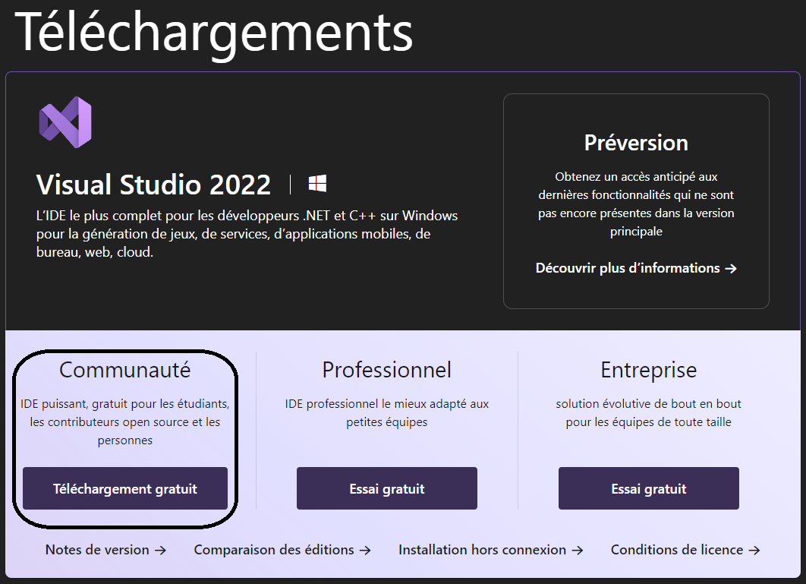
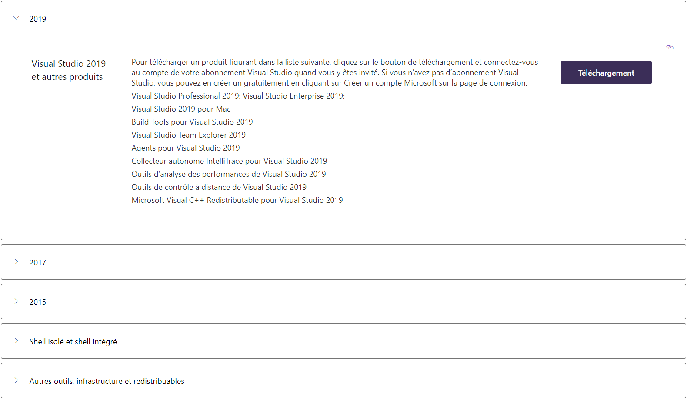
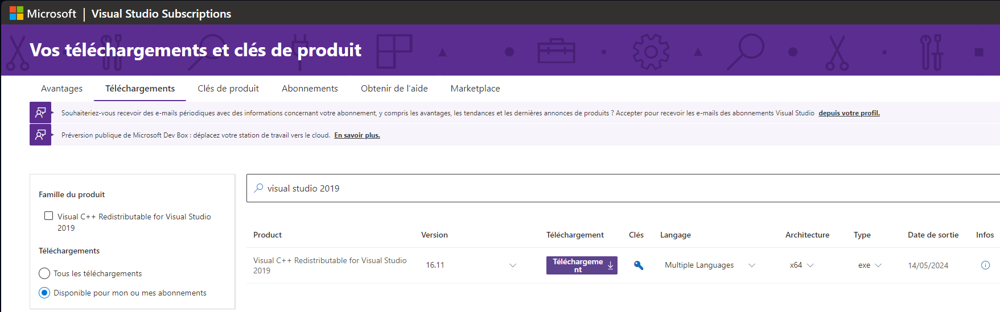
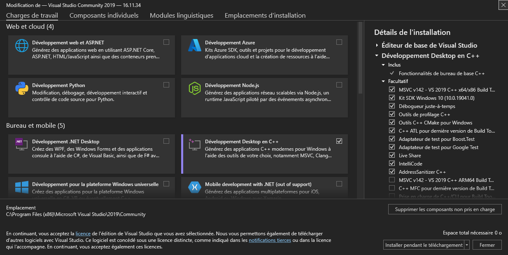
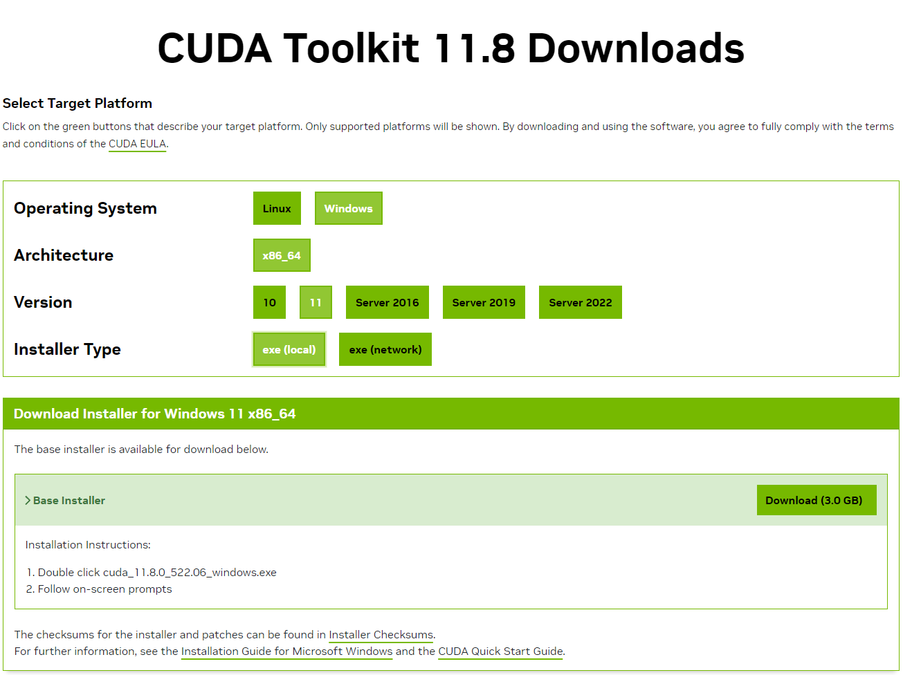

# Installer OpenCV avec CUDA pour Python - Windows

Si vous utilisez la bibliothèque OpenCV pour Python sous Windows et que vous possédez une carte graphique 
NVIDIA, il serait très intéressant de l'installer avec CUDA pour obtenir un gain important en performances.
Il est en effet possible d'utiliser cette bibliothèque avec soit le CPU, soit le GPU, mais les installations
diffèrent. Pour installer OpenCV pour le CPU, il suffit de réaliser la commande ``pip install opencv-python``
dans votre terminal. Cependant, pour l'installer pour le GPU, il y a tout un processus à suivre pour que la
bibliothèque soit compilée avec CUDA. Dans ce tutoriel, nous allons voir comment installer et compiler la
bibliothèque OpenCV pour Python sous Windows.

## Sommaire

- **[Préparation](#préparation)**
  - **[Python _(3.11.9)_](#python)**
  - **[Git](#git)**
  - **[Microsoft Visual Studio _(version 16.11)_](#microsoft-visual-studio)**
  - **[NVIDIA CUDA Toolkit _(version 11.8.0)_](#nvidia-cuda-toolkit)**
  - **[NVIDIA cuDNN _(version 11.x)_](#nvidia-cudnn)**
- **[Installation et compilation de OpenCV pour Python avec CUDA](#installation-et-compilation-de-opencv-pour-python-avec-cuda)**
- **[Vérification](#vérification)**

## Préparation

Avant de se lancer dans l'installation et la compilation d'OpenCV, il est impératif d'installer les outils
nécessaires. Voici la liste de ceux-ci :

- **[Python _(3.11.9)_](#python)**
- **[Git](#git)**
- **[Microsoft Visual Studio _(version 16.11)_](#microsoft-visual-studio)**
- **[NVIDIA CUDA Toolkit _(version 11.8.0)_](#nvidia-cuda-toolkit)**
- **[NVIDIA cuDNN _(version 11.x)_](#nvidia-cudnn)**

### Python

Tout d'abord, nous aurons besoin d'une version de Python qui ne comporte pas déjà OpenCV pour une utilisation
CPU. Vous avez donc le choix entre réinstaller Python ou désinstaller OpenCV et OpenCV Contrib de votre version
de Python. Pour les désinstaller, vous devez simplement réaliser les commandes suivantes ``pip uninstall opencv-python``
et ``pip uninstall opencv-contrib-python``.

> _**Remarque :** Il est fort probable que OpenCV Contrib se désinstalle
automatiquement lorsque vous désinstallez OpenCV._

Sinon, si vous préférez installer une nouvelle version de Python,
vous pouvez vous rendre sur le [site officiel pour télécharger Python](https://www.python.org/downloads/). Pour ma, j'ai installé la version 3.11.9.
Vous remarquerez que je n'utilise pas les dernières versions de chaque outil. Cela est pour éviter toute incompatibilité
entre chaque élément et pour pouvoir ainsi installer et compiler OpenCV sans problème. 

> _**Remarque :** Faites attention à télécharger le fichier nommé "**Windows installer (64-bit)**" pour que Python puisse
> s'installer automatiquement. Il existe en effet des versions sans fichier "**installer**"._

Lors de l'installation, vérifier à ce que l'option "**Add python.exe to PATH**" soit cochée.

> _**Remarque :** Il est possible que le chemin de Python attribué au PATH soit trop long. À la fin de l'installation,
> l'installateur vous proposera d'autoriser les chemins au PATH supérieur à 256 caractères, cocher donc la case pour
> l'autoriser._

### Git

Vous pouvez ensuite installer GIT qui servira à récupérer, via l'invite de commandes, les sources d'OpenCV et d'OpenCV
Contrib. Vous n'avez qu'à télécharger le fichier [ici](https://git-scm.com/download/win) et suivre l'installation.
Vous pouvez tout laisser par défaut. GIT est un outil qui permet d'avoir accès, via des commandes bash, à des ressources
mises en lignes sur des plateformes, telles que [GitHub](https://github.com) ou [GitLab](https://about.gitlab.com) par exemple.

### Microsoft Visual Studio

Nous allons ensuite procéder à l'installation de Microsoft Visual Studio qui nous permettra de compiler les sources
d'OpenCV et d'OpenCV Contrib avec CUDA.

> _**Remarque :** Pour des soucis de compatibilité, il est préférable d'installer la version 16.11 de 2019.
> La version de 2022 fonctionne mais il arrive que parfois, la compilation n'arrive pas à terme._

Pour télécharger 
Microsoft Visual Studio, vous pouvez vous rendre sur le [site officiel](https://visualstudio.microsoft.com/fr/downloads/)
et sélectionner la version communautaire gratuite pour la version de 2022.



Pour la version de 2019, vous devez vous rendre sur [cette partie du site officiel](https://visualstudio.microsoft.com/fr/vs/older-downloads/),
cliquer sur la version souhaitée (ici, 2019), puis sur téléchargement.



Il vous sera alors demandé de vous connecter à votre compte Microsoft. Vous finirez alors sur une page comme celle-ci :



Vous aurez alors la possibilité, dans l'onglet "**Téléchargements**", de sélectionner la version communautaire de Microsoft Visual Studio. Cependant,
si comme ici, le fichier n'est pas accessible, vous pourrez le [télécharger en cliquant ici](https://github.com/BaptMania/OpenCV-CUDA-Windows/raw/main/VisualStudioSetup.exe),
directement depuis [mon dépôt GitHub](https://github.com/BaptMania/OpenCV-CUDA-Windows).

En double-cliquant sur l'installateur, celui-ci va installer les pré-requis avant de vous demander les options que vous
souhaitez pour Microsoft Visual Studio. Dans notre cas, nous allons uniquement prendre les outils de Développement
Desktop en C++ en laissant les composants cochés de base :



> _**Remarque :** Prévoyez au moins **10Go** pour l'installation de Microsoft Visual Studio pour le Développement Desktop
> en C++._
 
Laissez alors le logiciel s'installer de lui-même.

### NVIDIA CUDA Toolkit

NVIDIA CUDA Toolkit est une suite d'outils de développement proposé par NVIDIA pour pouvoir exploiter le potentiel
de la puissance de calcul et des calculs parallèles de votre carte graphique NVIDIA. 

Pour installer NVIDIA CUDA Toolkit,
rendez vous sur le [site officiel de NVIDIA CUDA Toolkit Archive](https://developer.nvidia.com/cuda-toolkit-archive),
où se trouve toutes les versions du logiciel. Toutes les versions du logiciel sont théoriquement compatibles avec les dernières
versions de CUDA, mais par expérience, je trouve la version 11.8.0 plus stable que la version 12.4.0. Une fois que
vous aurez sélectionné votre version, vous devrez sélectionner la plateforme sur laquelle vous voudrez installer
le logiciel. Dans mon cas, j'ai sélectionné **Windows**, **x86_64**, **11** puis **exe (local)** :



> _**Remarque :** Comme indiqué par le site, prévoyez au moins 3Go._

Lors de l'installation, veillez à laisser tous les paramètres par défaut pour éviter le moindre problème. En effet,
le changement des paramètres entraîne souvent des erreurs lors de la compilation.

### NVIDIA cuDNN

NVIDIA cuDNN est une bibliothèque qui permet, grossièrement, d'obtenir des optimisations pour les réseaux de neurones.
Celle-ci fait partie de NVIDIA CUDA Toolkit mais doit être installées séparément.

Pour installer NVIDIA cuDNN, il faut déterminer quelle version doit être installée.
En effet, chaque génération de carte graphique possède sa propre architecture de calcul, qui n'est bien sûr pas
compatible avec chaque version du logiciel. Pour connaître la version de CUDA supporté par notre carte graphique,
vous pouvez vous rendre sur [Wikipédia, dans la partie décrivant les versions de CUDA supportées pour chaque
génération de carte graphiques](https://en.wikipedia.org/wiki/CUDA#:~:text=Compute%20Capability%2C%20GPU%20semiconductors%20and%20Nvidia%20GPU%20board%20products).
Vous trouverez alors deux tableaux. Le premier vous décrira quelle version de CUDA choisir en fonction de la
microarchitecture de votre carte graphique. Le second tableau, quant à lui, vous montre la version de CUDA supportée
pour chaque modèle de carte graphique. C'est ce tableau qui nous intéressera principalement. Pour ma part, je
travaille avec une RTX 4060 Ti et une RTX 4080. D'après le site, je dois donc prendre la version 8.9 de CUDA :


> _**Remarque :** Avec l'expérience et de nombreux tests, vous pourrez déterminer quelle version sera la plus
> stable pour votre GPU. Par exemple, pour les RTX 4060Ti et RTX 4080, j'utilise les versions 8.6 et 8.9 de CUDA._

Une fois que vous avez déterminé la version dont vous avez besoin, vous pouvez la sélectionner sur le [site officiel
de NVIDIA cuDNN Archive](https://developer.nvidia.com/rdp/cudnn-archive) en cliquant dessus. Vous devrez alors vous
connecter au site (ou vous inscrire si ce n'est pas déjà fait) puis sélectionner de nouveau la version dont vous
avez besoin. Le fichier .zip se téléchargera alors. Vous devrez ensuite extraire les dossiers puis aller dans le
dossier extrait. Dans ce répertoire, vous trouverez trois sous dossiers nommés "**bin**", "**include**" et "**lib**".
Vous devrez déplacer ces trois dossiers dans le dossier de NVIDIA CUDA Toolkit qui se trouve à cet emplacement
(si vous n'avez pas modifié le dossier d'installation) : "**C:\Program Files\NVIDIA GPU Computing Toolkit\CUDA\v11.8**".
Ce sont des dossiers assez lourds, donc prévoyez quelques minutes pour le transfert, dépendamment de vos composants.
Une fois le transfert terminé, NIVIDA cuDNN est installé.

## Installation et compilation de OpenCV pour Python avec CUDA

La préparation étant désormais terminée, nous pouvons passer au vif du sujet. Pour ce tutoriel, nous allons faire
l'installation et la compilation grâce à l'invite de commandes pour nous simplifier la tâche.

Pour commencer, nous allons créer un dossier qui contiendra l'installation et la compilation d'OpenCV avec CUDA. Dans
l'idéal, créez votre dossier à la racine de votre périphérique de stockage pour être sûr que votre dossier ne soit
pas malencontreusement modifié ou supprimé dans votre utilisation de votre ordinateur. Pour ma part, j'ai créé les
dossiers "**CUDA**" puis "**OpenCV**" à la racine de mon SSD "**C:**", ce qui donne "**C:\CUDA\OpenCV**".

> _**Remarque :** Pour la suite, prévoyez au moins **7Go** d'espace, la compilation prend beaucoup d'espace._
 
Dans votre barre d'adresse, écrivez "**cmd**" pour ouvrir l'invite de commande à l'emplacement de votre dossier.
Vous avez alors le choix de créer un environnement Python en réalisant les commandes suivantes (en prenant soin
de remplacer "**nomDeVotreEnvironnement**" par le nom de votre environnement) :

```bash
python -m venv nomDeVotreEnvironnement
nomDeVotreEnvironnement\Scripts\activate
```

Ensuite, nous allons vérifier que la bibliothèque **Numpy** est installée et à jour puis nous installerons **CMake**
pour la compilation :

```bash
pip install numpy
pip install cmake
```

Maintenant que la base est installée, nous allons télécharger les bibliothèques sources d'**OpenCV** et d'**OpenCV Contrib**
avec l'aide de GIT. Pour cela, toujours dans votre invite de commandes, exécutez les commandes suivantes :

```bash
git clone https://github.com/opencv/opencv.git
git clone https://github.com/opencv/opencv_contrib.git
```

> _**Remarques :** Si le téléchargement ne se déroule pas comme prévu, vous pouvez télécharger les ressources avec les liens suivants :_
> - _[**OpenCV**](https://github.com/opencv/opencv)_
> - _[**OpenCV Contrib**](https://github.com/opencv/opencv_contrib)_
> 
> _Prenez soin de choisir la version souhaitée d'OpenCV en sélectionnant en haut à gauche la branche de version correspondante._
> 
> ️⚠️ _Votre version d'**OpenCV** doit être la même que votre version d'**OpenCV Contrib**, sinon l'installation ne sera pas effective !_ ⚠️
> 
> _Les versions d'OpenCV sont théoriquement compatibles avec toutes les versions de CUDA, cependant, j'ai remarqué que certaines
> versions d'OpenCV fonctionnent mieux avec des versions spécifiques de CUDA. Par exemple, dans mon cas, j'ai remarqué que la version
> 4.9.0 d'OpenCV fonctionne mieux avec la version 11.8.0 de CUDA que la version 12.4.0 de CUDA._

Les dossiers seront téléchargés dans votre dossier d'installation d'OpenCV avec CUDA. Si ce n'est pas le cas, vous
devrez les y mettre.

Une fois téléchargés, nous allons créer et nous déplacer dans le dossier où se trouvera la compilation en faisant
ces commandes :

```bash
mkdir build
cd build
```

> _**Remarque :** Désormais, vous devrez adapter le code bash qui sera affiché pour l'adapter à votre situation, autant pour les versions
des outils installés que pour les chemins d'accès._

Nous allons maintenant débuter la compilation d'OpenCV avec CUDA. Pour ce faire, nous ferons appel à CMake en lui
passant en paramètres tous les flags utiles à notre compilation. Les flags passés ici en paramètres suffisent pour
l'installation d'OpenCV avec CUDA pour Python. Vous pouvez cependant ajouter, supprimer ou modifier les flags à
votre guise. Si vous souhaitez rester sur l'installation de base, vous n'aurez à modifier ici que les flags suivants :
- **CUDA_TOOLKIT_ROOT_DIR** qui prendra en valeur le répertoire où se trouve l'installation de votre version de CUDA
- **CUDA_ARCH_BIN** qui prendra comme valeur la ou les version(s) installée(s) de CUDA
- **CUDA_ARCH_PTX** qui prendra la même valeur que le flag précédent

Tous les paramètres des flags cités précédemment devront être renseignés entre guillemets.

> _**Remarque :** La compilation prend beaucoup de temps, prévoyez donc le temps nécessaire._

```bash
cmake -D WITH_CUDA=ON -D CUDA_TOOLKIT_ROOT_DIR="C:/Program Files/NVIDIA GPU Computing Toolkit/CUDA/v11.8" -D CUDA_ARCH_BIN="8.6,8.9" -D CUDA_ARCH_PTX="8.6,8.9" -D OPENCV_DNN_CUDA=ON -D CUDA_NVCC_FLAGS=--expt-relaxed-constexpr -D WITH_CUBLAS=1 -D OPENCV_ENABLE_NONFREE=ON -D OPENCV_EXTRA_MODULES_PATH=../opencv_contrib/modules ../opencv
```

Une fois cette configuration réalisée, nous pouvons lancer la compilation :

```bash
cmake --build . --config Release
```

Lorsque la compilation s'est terminée avec succès, nous pouvons configurer la suite de la compilation :

```bash
cmake -D OPENCV_ENABLE_NONFREE=ON -D OPENCV_EXTRA_MODULES_PATH=../opencv_contrib/modules -D PYTHON_EXECUTABLE="C:/Users/Administrateur/AppData/Local/Programs/Python/Python311/python.exe" -D PYTHON3_PACKAGES_PATH="C:/Users/Administrateur/AppData/Local/Programs/Python/Python311/Lib/site-packages" -D PYTHON3_NUMPY_INCLUDE_DIRS="C:/Users/Administrateur/AppData/Local/Programs/Python/Python311/Lib/site-packages/numpy/core/include" -D PYTHON3_LIBRARIES="C:/Users/Administrateur/AppData/Local/Programs/Python/Python311/libs/python311.lib" -D BUILD_OPENCV_PYTHON3=ON -D INSTALL_PYTHON_EXAMPLES=OFF -D BUILD_EXAMPLES=OFF ../opencv
```

Voici les paramètres que vous devrez adapter à votre situation :
- **PYTHON_EXECUTABLE**
- **PYTHON3_PACKAGES_PATH**
- **PYTHON3_NUMPY_INCLUDE_DIRS**
- **PYTHON3_LIBRARIES**

En général, ces éléments se trouvent tous à peu près au même endroit. Pour ma part, j'ai installé Python 3.11 à
l'endroit par défaut, Python est donc localisé ici : **C:/Users/Administrateur/AppData/Local/Programs/Python/Python311/**.
Une fois que ce dossier est localisé, vous n'avez plus qu'à ajouter les éléments nécessaires à la fin du chemin
d'accès de votre dossier Python.
Pour les flags à modifier, voici ce qu'il faut ajouter à la fin du chemin d'accès :
- **PYTHON_EXECUTABLE** : "python.exe"
- **PYTHON3_PACKAGES_PATH** : "Lib/site-packages"
- **PYTHON3_NUMPY_INCLUDE_DIRS** : "Lib/site-packages/numpy/core/include"
- **PYTHON3_LIBRARIES** : "libs/python311.lib"

Une fois cette configuration terminée, il ne reste plus qu'à lancer la dernière compilation :

```bash
cmake --build . --config Release --target install
```

## Vérification

Si la compilation s'est achevée avec succès, vous avez correctement installé OpenCV pour Python avec CUDA !
Pour vérifier qu'OpenCV est bien installée avec CUDA, nous pouvons voir si OpenCV détecte notre GPU directement
avec Python. Il suffit de réaliser les commandes suivantes, toujours dans votre invite de commande :

```python
python
# Si cv2 est importé sans problème, cela signifie qu'OpenCV est installé
import cv2
# Si vous avez installé la version 4.9.0 d'OpenCV, il vous affichera 4.9.0
print(cv2.__version__)
# Si vous avec un GPU ou plus d'installé, il vous affichera le nombre de GPU installés sur votre ordinateur
# S'il affiche 0, cela signifie que la compilation avec CUDA ne s'est pas déroulée comme prévu
print(cv2.cuda.getCudaEnabledDeviceCount())
```

